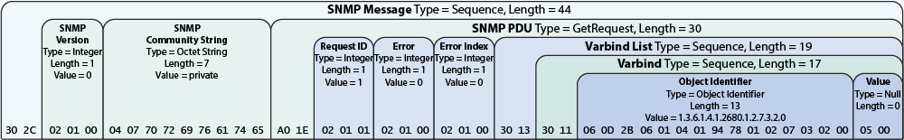
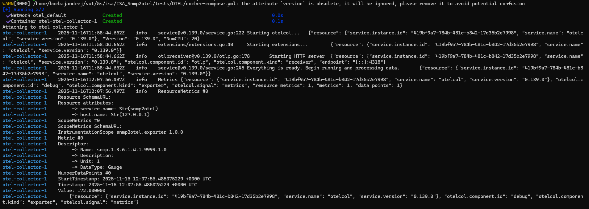

# Snmp2otel - Exportér SNMP Gauge metrik do OpenTelemetry (OTEL)

## Zadanie
Napište program snmp2otel, který bude v pravidelných intervalech dotazovat zadaný SNMP agent (zařízení) na vybrané OID a naměřené hodnoty exportovat jako OTEL Metrics pomocí rozhraní OTLP/HTTP (JSON) na zadaný OTEL endpoint (typicky OpenTelemetry Collector). Analýza a sestavení SNMP v2c zpráv i OTLP/HTTP JSON těla může být implementována libovolným způsobem dle vašeho návrhu. Uvažujte komunikaci přes UDP/161 pro SNMP (klient) a TCP/HTTP pro export (HTTPS volitelné v rozšíření).

Program musí podporovat pouze metriky typu Gauge.

### Obmedzenia
- Povoleny jsou libovolné knihovny.
- Instalace knihoven do systému není povolena; projekt se musí přeložit standardně pomocí Makefile.
- Program poběží bez root oprávnění; nesmí vyžadovat privilegované porty pro lokální naslouchání.

### Podporované protokoly a datové typy
- SNMP v2c: podporujte pouze operaci Get pro skalární OID zakončená .0.
- ASN.1 BER: implementujte minimum potřebné pro SNMPv2c Get/Response (INTEGER, OCTET STRING, OID, SEQUENCE).
- OTEL export: data se posílají pomocí OTLP/HTTP (JSON).
Každý naměřený údaj je reprezentován jako Gauge.

### Výstup aplikace
- V základním režimu program nic nevypisuje.
- Ve verbose režimu (-v) vypisujte ladicí informace (dotazy, odpovědi, export).
- Chybové hlášky vypisujte na standardní chybový výstup.

## Protokol SNMPv2: Popis Funkčnosti
Protokol SNMPv2 (Simple Network Management Protocol verzia 2) je rozšírená a vylepšená verzia štandardného protokolu pre správu a monitorovanie sieťových zariadení, ako sú smerovače, prepínače, servery a tlačiarne. Umožňuje centrálnemu manažérovi (NMS - Network Management Station) získavať informácie a meniť konfiguráciu spravovaných zariadení.

### 1. Kľúčové Komponenty
SNMP model pozostáva z troch základných komponentov:
- Správca Siete (Network Management Station - NMS): Centrálna stanica, ktorá spúšťa aplikácie pre správu. Odošle požiadavky a prijíma odpovede a nežiaduce notifikácie (trapy).
- Spravované Zariadenie (Managed Device): Sieťový komponent (napr. router, switch), ktorý obsahuje dáta, ktoré sa majú spravovať.
- Agent: Softvérový modul bežiaci na spravovanom zariadení. Zhromažďuje informácie o zariadení, spracováva požiadavky od NMS a posiela odpovede/notifikácie.

### 2. Dátová Štruktúra
- MIB (Management Information Base): Je to hierarchická databáza (virtuálna informačná štruktúra) na spravovanom zariadení, ktorá definuje premenné (objekty), ktoré môže NMS spravovať. Každá premenná má jedinečný OID (Object Identifier).

- OID (Object Identifier): Unikátny identifikátor v stromovej štruktúre, ktorý presne odkazuje na konkrétnu premennú v MIB (napr. počet chybových paketov na danom porte).

### 3. Komunikácia a Správy
SNMPv2 primárne využíva protokol UDP (User Datagram Protocol) na portoch 161 (požiadavky/odpovede) a 162 (notifikácie/trapy) pre nespoľahlivú a rýchlu komunikáciu.

#### A. Základné Typy PDU (Protocol Data Unit - Typy Správ)
| Typ Správy | Odosielateľ | Príjemca | Popis Funkcie |
| :--- | :--- | :--- | :--- |
| `GetRequest` | NMS | Agent | Žiadosť o jednu alebo viac hodnôt premenných. |
| `GetNextRequest` | NMS | Agent | Žiadosť o hodnotu **nasledujúcej** premennej v MIB, umožňuje prechádzanie (walk) celej MIB. |
| `GetBulkRequest` | NMS | Agent | **Novinka v v2:** Efektívna žiadosť o prenos veľkého bloku dát. |
| `SetRequest` | NMS | Agent | Žiadosť o **zmenu** hodnôt premenných na zariadení (konfigurácia). |
| `Response` | Agent | NMS | Odpoveď na akúkoľvek Get alebo Set požiadavku, obsahuje požadované dáta alebo stav operácie. |
| `Trap` | Agent | NMS | **Nežiaduce** asynchrónne upozornenie na **významnú udalosť** (napr. reštart zariadenia). |
| `InformRequest` | NMS | NMS | **Novinka v v2:** Notifikácia zaslaná medzi dvoma NMS; vyžaduje **potvrdenie** o prijatí. |

#### B. Mechanizmus Komunít (Communities)
SNMPv2 používa "reťazce komunity" (Community Strings) ako formu základného hesla/autentifikácie.

- Agent prijme požiadavku len vtedy, ak sa reťazec komunity v správe zhoduje s nakonfigurovaným reťazcom na zariadení.

Existujú dva bežné typy:
- read-only (len na čítanie): Umožňuje len Get operácie.
- read-write (čítanie/zápis): Umožňuje Get aj Set operácie.

## OpenTelemetry (OTEL) a HTTP/JSON Metriky
OpenTelemetry (OTEL) je open source projekt, ktorý poskytuje unifikovaný súbor nástrojov, API a SDK na inštrumentáciu, generovanie, zhromažďovanie a export telemetrických dát (logy, tracy a metriky).

> Protokol pre prenos týchto dát sa nazýva OTLP (OpenTelemetry Protocol). Ten podporuje dva hlavné formáty kódovania/prenosu:

- OTLP/gRPC (preferovaný): Využíva binárny formát Protocol Buffers pre efektívny a rýchly prenos.

- OTLP/HTTP/JSON (vlastná požiadavka): Využíva štandardný protokol HTTP s dátovou záťažou (payload) kódovanou vo formáte JSON.

### Čo je to OTEL/HTTP/JSON Metrics?
Ide o štandardizovaný formát a metódu prenosu metriky z aplikácie alebo služby do kolektora alebo monitorovacieho backendu.

> Používa sa HTTP/HTTPS pre prenos.

Štandardizovaný Formát: Metriky sú štruktúrované podľa OTLP Data Modelu a odosielajú sa ako JSON objekt v tele HTTP požiadavky (zvyčajne POST).

#### Štruktúra Metriky
- **Názov** (Name), **Popis** (Description) a **Jednotku** (Unit).
- **Typ metriky** (napr. Counter, Gauge, Histogram).
- **Dátové body** (Data Points): Samotné merané hodnoty, ktoré zahŕňajú časovú značku (timestamp) a sadu Atribútov (Attributes).
- **Atribúty**: Pár kľúč-hodnota, ktoré poskytujú kontext 
    - Napr. http.request.method: POST, status_code: 200, service.name: nazov-programu.

### Načo sa OTEL/HTTP/JSON Metriky Používajú?
Hlavným cieľom je dosiahnuť observability (pozorovateľnosť) aplikácií a infraštruktúry bez vendor lock-in.

> Jednotný Štandard: Poskytuje konzistentný spôsob, ako zbierať metriky, bez ohľadu na to, v akom jazyku bola aplikácia napísaná (Java, Python, .NET, Go, C++, atď.).

Agregácia a Analýza: Metriky sú základom pre monitorovanie stavu, výkonu a dostupnosti dakeho programu (napr. latencia HTTP požiadaviek, počet chýb, využitie pamäte).

> [!Note] Flexibilita Exportu
Umožňuje odosielať dáta do rôznych systémov (Prometheus, Grafana, Jaeger, komerčné backends) prostredníctvom jedného protokolu – OTLP.


## Implementácia
Táto sekcia detailne popisuje architektúru programu a techniky implementácie použité pre zber metrík prostredníctvom protokolu SNMPv2c a ich následný export vo formáte OTEL/HTTP/JSON.

### 1. Konfigurácia a Dátové Štruktúry
Všetky vstupné a konfiguračné parametre programu sú centralizované v dátovej štruktúre SnmpOtelConfig. Táto štruktúra slúži ako jediný zdroj pravdy pre nastavenia súvisiace s cieľovými SNMP Agentmi, OID (Object Identifiers) a koncovými bodmi (endpoints) pre export OTEL.

Logika aplikácie je enkapsulovaná v triede SnmpOtel_BL (Business Logic), čím je zabezpečená správna modularita a oddelenie obchodnej logiky od prezentačnej a sieťovej vrstvy.

### 2. Komunikácia s SNMP Agentmi (SNMPv2c)
Získavanie surových metrík zo sieťových zariadení je realizované prostredníctvom protokolu SNMPv2c.



#### A. Generovanie a Kódovanie SNMPv2c Správ
Knižnica pre Dátové Transformácie: Pre spracovanie dátových štruktúr SNMP využívame knižnicu BasicSNMP (silderan/BasicSNMP). Knižnica je primárne zodpovedná za kódovanie a dekódovanie dát v súlade s oficiálnymi štandardmi protokolu.

Kódovanie ASN.1 BER: Knižnica implementuje algoritmus ASN.1 BER (Basic Encoding Rules). Tento proces je nevyhnutný pre transformáciu internej dátovej štruktúry požiadavky (ktorá zahŕňa verziu protokolu, reťazec komunity – Community String a požadované OID) do korektného binárneho formátu. Tento formát je následne pripravený na bezchybný prenos cez sieť.

#### B. Sieťový Prenos
Po zakódovaní správy knižnicou BasicSNMP prebieha sieťová komunikácia prostredníctvom vlastného UDP klienta, ktorý je implementovaný v triede SnmpOtelClient.

Klient preberá binárne zakódovanú požiadavku (napr. GetRequest) a odosiela ju pomocou protokolu UDP na štandardný port 161 cieľového SNMP Agenta.

Po odoslaní čaká klient na prichádzajúcu UDP odpoveď, ktorá je následne odovzdaná späť knižnici BasicSNMP na dekódovanie, čím sa získajú finálne hodnoty metrík.

### 3. Transformácia a Export Metrík (OTEL/HTTP/JSON)
Po úspešnom zbere dát sú SNMP hodnoty transformované do štandardizovaného formátu OpenTelemetry (OTEL).

#### A. Generovanie Dátovej Štruktúry OTEL
Modelovanie Metrík: Pre zabezpečenie zhody s OTEL OTLP/JSON špecifikáciou je definovaná vlastná hierarchická štruktúra OpenTelemetryMetrics. Táto štruktúra vychádza zo vzorového dátového modelu definovaného v OpenTelemetry protokole, konkrétne zo špecifikácie:

https://github.com/open-telemetry/opentelemetry-proto/blob/main/examples/metrics.json

Konverzia na JSON: Transformácia dátovej štruktúry OpenTelemetryMetrics do finálneho JSON formátu je zabezpečená pomocou knižnice nlohmann/json. Špecificky, funkcia SnmpOtelJson::CreateOtlpMetricsJson vykonáva túto konverziu. Funkcia vracia výsledný JSON objekt ako std::string, typicky bez formátovania (bez odsadenia) pre optimalizáciu sieťového prenosu a jednoduché porovnanie dát.

#### B. Export Metrík
Export dát je riadený triedou SnmpOtelExport, ktorá využíva knižnicu httplib.h (od Yuji Hirose) pre robustnú a spoľahlivú HTTP/S komunikáciu.

Funkcia SnmpOtelExport::SendHttpMessage prevezme JSON std::string metrík.

Následne iniciuje HTTP POST požiadavku (s Content-Type: application/json) na nakonfigurovaný koncový bod OTEL Collectora alebo priameho monitorovacieho backendu. Týmto je zabezpečený finálny prenos spracovaných telemetrických dát.

### 4. Spracovanie Signálov
Pre riadne ukončenie programu a uvoľnenie zdrojov je implementovaný mechanizmus spracovania signálov. Trieda SignalHandler zabezpečuje registráciu prerušenia (napr. kombinácia kláves Ctrl+C). V prípade detekcie signálu je vyvolaná obslužná funkcia, ktorá iniciuje riadené ukončenie logiky programu, čím sa predchádza nekonzistentnému stavu alebo poškodeniu dát.


## Použitie
```bash
snmp2otel -t target [-C community] -o oids_file -e endpoint [-i interval] [-r retries] [-T timeout] [-p port] [-v] [-O oids_formatingMappingFile]
```

### Parametre

-t target — IP adresa nebo DNS jméno SNMP agenta.  
-C community — SNMP v2c community string. Výchozí: public.  
-o oids_file — soubor se seznamem OID, které se mají dotazovat.  
-e endpoint — URL OTEL endpointu pro export (OTLP/HTTP JSON), např. http://localhost:4318/v1/metrics.  
-i interval — perioda dotazování v sekundách (> 0). Výchozí: 10.  
-r retries — počet retransmisí při timeoutu. Výchozí: 2.  
-T timeout — timeout SNMP dotazu v ms. Výchozí: 1000.  
-p port — UDP port SNMP agenta. Výchozí: 161.  
-v — verbose režim.  

### Formát souboru se seznamem OID

Textový ASCII soubor: jedno OID na řádek, numerická forma. Prázdné řádky a řádky začínající # ignorujte.

```
# System uptime
1.3.6.1.2.1.1.3.0
```

### Formát mapping souboru (volitelný)
```
{
  "1.3.6.1.2.1.1.3.0": { "name": "snmp.sysUpTime", "unit": "ms", "type": "gauge" }
}
```
- *type* může být pouze gauge. Pokud položka chybí, použije se název odvozený z OID.

## Použité technológie

## Testovanie

Ako prvotne testovanie bolo potrebne overit funkcnost SNMPV2c a nasledne overenie OTEL json.

pre overenie spravnej funkcie snmpV2c sme si vytvorili snmpAgenta v c++ ktory sluzil na posielanie konstantnych metrik pre vyziadane OIDs. S tymto sposobom sme si overili funkcnost pre posielanie snmp cez udp a nasledne spracovanie spravy od snmpagenta.

neskor sme prisli na to ze je mozne vyuzivat snmpagent na skolskom servery merlina@vutbr.cz - lepsi referencny server.


spojazdenie otel programu pre overovanie poslanych http post sprav na otel endpoint.



kontrola vytvorenych snmp paketov cez kontrolu vo wireshark a kontrola hex cisiel.


### Zdroje

SnmpV2c  
https://www.ranecommercial.com/legacy/note161.html
https://www.dpstele.com/snmp/tutorial/packet-types-structure.php
https://support.huawei.com/enterprise/en/doc/EDOC1100174721/684b4c64/snmpv1

OTEL  
https://stackoverflow.com/questions/18119428/c-how-to-exit-out-of-a-while-loop-recvfrom
https://github.com/open-telemetry/opentelemetry-proto/blob/main/examples/metrics.json
